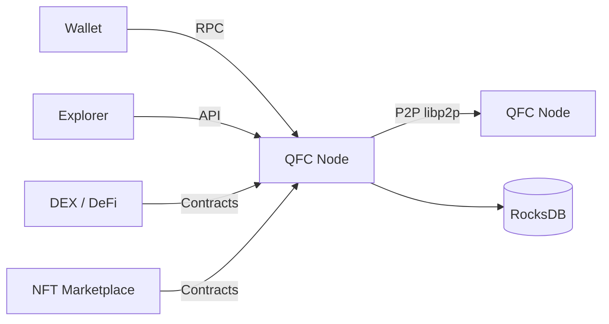
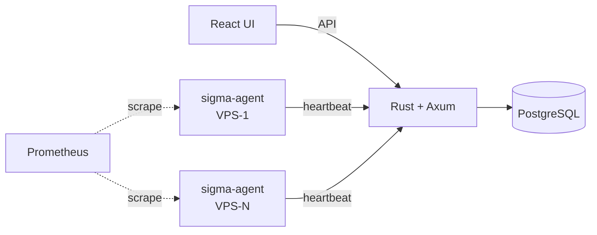
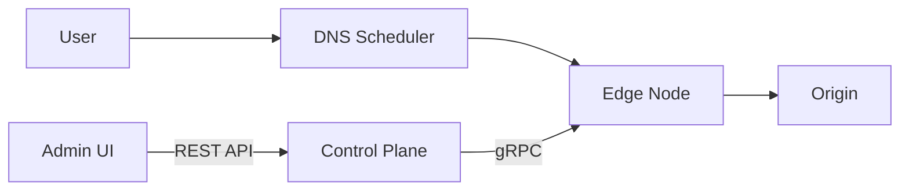
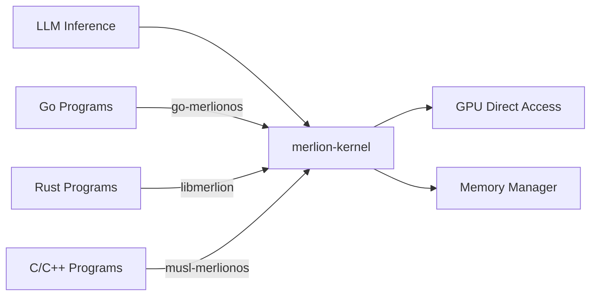

### Hi there 👋

I'm a DevOps/SRE engineer focused on building high-performance distributed systems.

#### 🔧 What I work with

**Infrastructure:** Kubernetes, Istio, Docker, Terraform 
**Monitoring:** Prometheus, Grafana, Thanos, ClickHouse 
**Cloud:** AWS 
**Languages:** Rust, Go, TypeScript, Python

---

#### ⛓️ Featured Project: [QFC Blockchain](https://github.com/qfc-network)

A custom Layer 1 blockchain with Proof-of-Contribution consensus, DeFi, NFT marketplace, and full wallet ecosystem.

**Core:** [qfc-core](https://github.com/qfc-network/qfc-core) — Rust blockchain node with Blake3 PoW, Merkle Patricia Trie, Ed25519/VRF cryptography, libp2p networking 
**Ecosystem:** Explorer, DEX, NFT marketplace, wallet (desktop + mobile), faucet, AI inference router, SDK (JS/Python), VS Code extension 
**34 repositories** covering the full blockchain stack

**Tech stack:** Rust, RocksDB, libp2p, Blake3, Ed25519, React, TypeScript, Solidity

---

#### 🛰️ Featured Project: [Sigma](https://github.com/lai3d/sigma)

Lightweight VPS fleet management platform — track instances across dozens of cloud providers, manage IP addresses, and monitor with Prometheus/Grafana.

**Components:** sigma-api (Rust/Axum), sigma-web (React), sigma-agent, sigma-probe, sigma-cli 
**Tech stack:** Rust, Axum, PostgreSQL, Redis, Prometheus, Grafana, Thanos, React, Docker, K8s

---

#### 🚀 Featured Project: [EdgeFlow CDN](https://github.com/EdgeFlowCDN)

A self-built content delivery network with edge caching, intelligent scheduling, and security.

**Highlights:**
- **Edge Node** ([cdn-edge](https://github.com/EdgeFlowCDN/cdn-edge)) — 32K QPS caching proxy with two-tier LRU cache, WAF, HTTP/3, Gzip/Brotli, WebSocket, image optimization
- **Control Plane** ([cdn-control](https://github.com/EdgeFlowCDN/cdn-control)) — REST API + gRPC config sync, JWT + TOTP 2FA, audit logging
- **Scheduler** ([cdn-scheduler](https://github.com/EdgeFlowCDN/cdn-scheduler)) — DNS + HTTP 302 routing with GeoIP, health checks, load-weighted selection
- **Admin Console** ([cdn-console](https://github.com/EdgeFlowCDN/cdn-console)) — React + TypeScript + Ant Design dashboard
- **8 repositories** covering edge proxy, control plane, scheduler, console, CLI, deployment, Terraform, design docs

**Tech stack:** Go, gRPC, PostgreSQL, Redis, ClickHouse, Prometheus, React, Docker, K8s

---

#### 🧠 Featured Project: [MerlionOS](https://github.com/MerlionOS)

A bare-metal operating system purpose-built for LLM inference — zero overhead, maximum throughput.

**Core:** [merlion-kernel](https://github.com/MerlionOS/merlion-kernel) — Custom kernel with GPU-first scheduling, zero-copy memory management 
**Language support:** Go ([go-merlionos](https://github.com/MerlionOS/go-merlionos)), Rust ([libmerlion](https://github.com/MerlionOS/libmerlion)), C/C++ ([musl-merlionos](https://github.com/MerlionOS/musl-merlionos)) 
**Inference:** [merlion-infer](https://github.com/MerlionOS/merlion-infer) — Bare-metal LLM inference engine 
**Zig port:** [merlionos-zig](https://github.com/MerlionOS/merlionos-zig) — Clean reimplementation in Zig 
**Try it:** [Playground](https://github.com/MerlionOS/merlionos-playground)

**Tech stack:** Rust, Zig, Assembly, C, Go, GPU/CUDA
