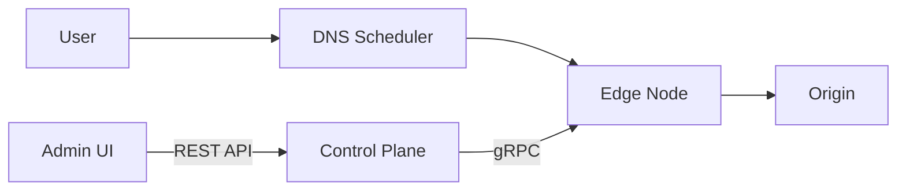
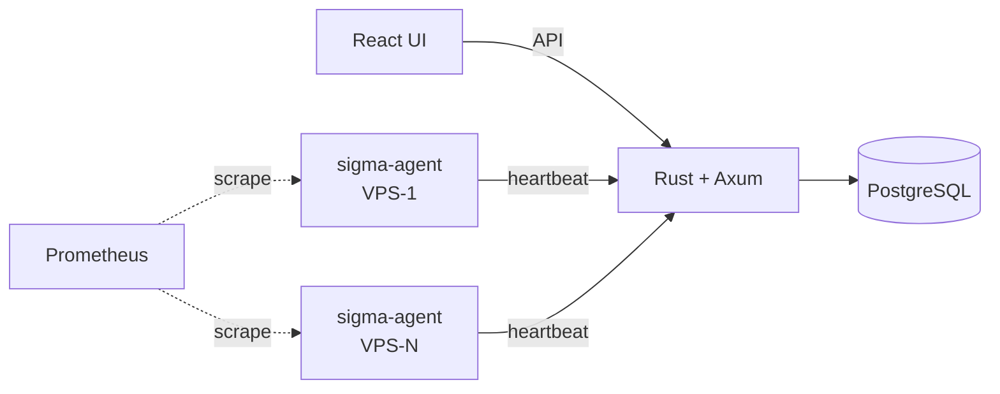

### Hi there 👋

I'm a DevOps/SRE engineer focused on building high-performance distributed systems.

#### 🔧 What I work with

**Infrastructure:** Kubernetes, Istio, Docker, Terraform
**Monitoring:** Prometheus, Grafana, Thanos, ClickHouse
**Cloud:** AWS, Linux
**Languages:** Go, Rust, TypeScript, Python

---

#### 🚀 Featured Project: [EdgeFlow CDN](https://github.com/EdgeFlowCDN)

A self-built content delivery network with edge caching, intelligent scheduling, and security.

**Highlights:**
- **Edge Node** ([cdn-edge](https://github.com/EdgeFlowCDN/cdn-edge)) — 32K QPS caching proxy with two-tier LRU cache, WAF, HTTP/3, Gzip/Brotli, WebSocket, image optimization
- **Control Plane** ([cdn-control](https://github.com/EdgeFlowCDN/cdn-control)) — REST API + gRPC config sync, JWT + TOTP 2FA, audit logging
- **Scheduler** ([cdn-scheduler](https://github.com/EdgeFlowCDN/cdn-scheduler)) — DNS + HTTP 302 routing with GeoIP, health checks, load-weighted selection
- **Admin Console** ([cdn-console](https://github.com/EdgeFlowCDN/cdn-console)) — React + TypeScript + Ant Design dashboard
- **Deployment** ([cdn-deploy](https://github.com/EdgeFlowCDN/cdn-deploy)) — Docker Compose + Kubernetes manifests
- **CLI** ([cdn-cli](https://github.com/EdgeFlowCDN/cdn-cli)) — Command-line management tool
- **Design Docs** ([cdn-design](https://github.com/EdgeFlowCDN/cdn-design)) — Architecture & design documents (中文 / English)

**Tech stack:** Go, gRPC, PostgreSQL, Redis, ClickHouse, Prometheus, React, Docker, K8s

---

#### 🛰️ Featured Project: [Sigma](https://github.com/lai3d/sigma)

Lightweight VPS fleet management platform — track instances across dozens of cloud providers, manage IP addresses, and monitor with Prometheus/Grafana.

**Components:** sigma-api (Rust/Axum), sigma-web (React), sigma-agent, sigma-probe, sigma-cli
**Tech stack:** Rust, Axum, PostgreSQL, Redis, Prometheus, Grafana, Thanos, React, Docker, K8s
